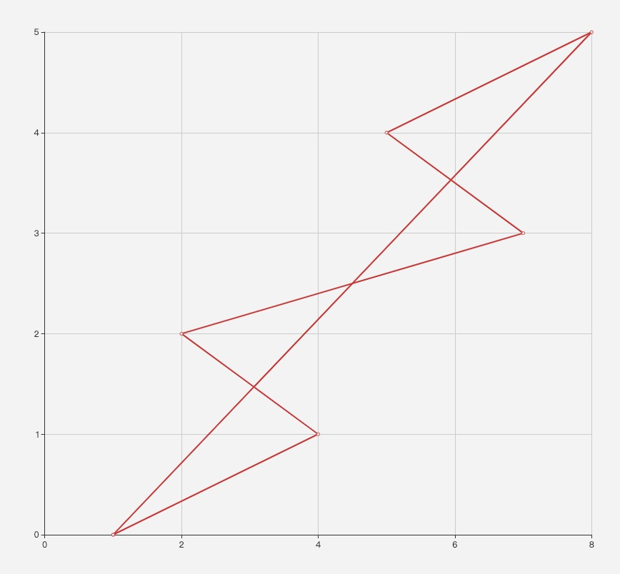

# 142857

## echarts

### code

  ```bash
    var baseDate = String(142758).split('').map((num, index) => [num, index])

    option = {
        xAxis: {
            type: 'value'
        },
        yAxis: {
            type: 'value'
        },
        series: [{
            data: baseDate.concat([[1,0]]),
            type: 'line'
        }]
    };

  ```
  
  
